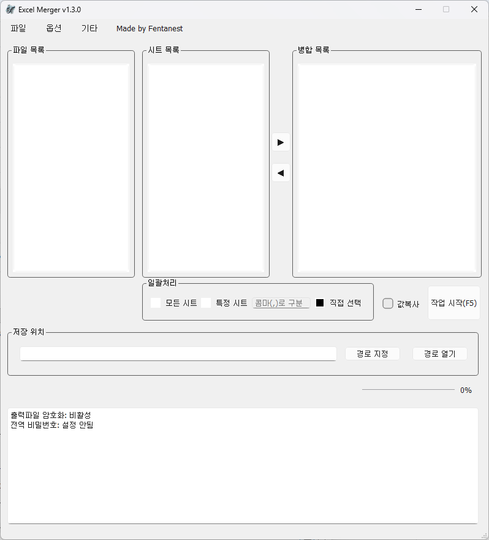
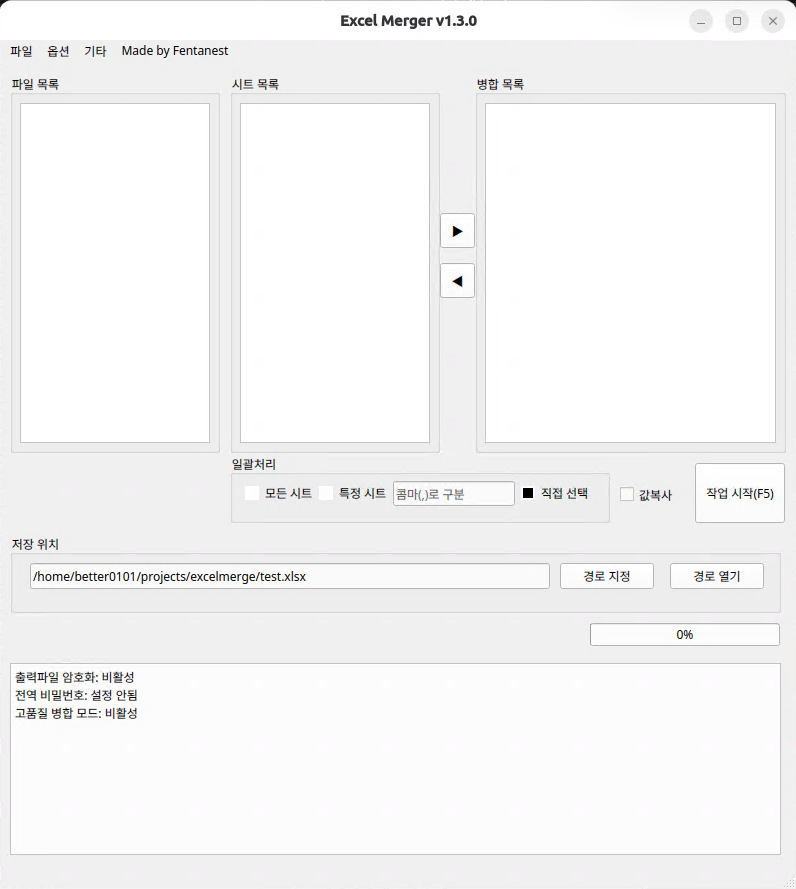

# Excel Merger (엑셀 병합 프로그램)
| 
Windows
 | 
Ubuntu
 |
| --- | --- |
|  |  |

여러 개의 엑셀(Excel) 파일을 열어 원하는 시트(Sheet)만 골라 하나의 파일로 손쉽게 합쳐주는 GUI 프로그램입니다. 반복적인 복사/붙여넣기 작업은 이제 그만! Excel Merger가 여러분의 작업을 효율적으로 만들어 드립니다.

## ✨ 주요 기능

*   **간편한 파일 추가**: 여러 개의 엑셀 파일을 한 번에, 또는 드래그 앤 드롭으로 간편하게 추가할 수 있습니다.
*   **다양한 병합 옵션**:
    *   **시트 병합**: 여러 파일의 시트를 하나의 새 파일에 각각의 시트로 옮겨옵니다.
    *   **세로 병합 (행 통합)**: 여러 시트의 데이터를 하나의 시트에 세로로(아래로) 이어 붙여 합칩니다.
    *   **가로 병합 (열 통합)**: 여러 시트의 데이터를 하나의 시트에 가로로(옆으로) 이어 붙여 합칩니다.
*   **강력한 암호 처리**:
    *   암호가 걸린 엑셀 파일도 문제없이 열 수 있습니다. (전역 암호 설정 지원)
    *   병합된 최종 결과물 파일에 새로운 암호를 설정하여 저장할 수 있습니다.
*   **고급 기능**:
    *   **고품질 병합 (Windows 전용)**: Windows 환경에서는 원본의 서식과 수식을 그대로 보존하며 완벽하게 시트를 복사합니다.
    *   **값만 복사**: 복잡한 수식은 제외하고 셀에 표시된 값만 깔끔하게 복사할 수 있습니다.
    *   **빈 행/열 자동 삭제 (SheetTrim)**: 데이터 중간에 있는 불필요한 빈 행이나 열을 지정한 개수만큼 자동으로 삭제하여 깔끔하게 정리합니다.

## 📖 사용 방법

1.  **파일 추가**: `파일` -> `엑셀파일 추가(Ctrl+O)` 메뉴를 클릭하거나, 프로그램 왼쪽의 파일 목록 영역으로 엑셀 파일을 드래그 앤 드롭하여 추가합니다.
2.  **시트 선택**: 왼쪽의 '추가된 파일 목록'에서 파일을 선택하면, 중앙의 '파일 내 시트 목록'에 해당 파일의 시트들이 나타납니다. 병합하고 싶은 시트를 선택하여 오른쪽 '병합할 시트 목록'으로 옮기세요. (더블클릭 또는 `Enter`, 화살표 버튼 사용)
3.  **병합 순서 및 방식 설정**:
    *   오른쪽 '병합할 시트 목록'에서 시트를 드래그하여 병합 순서를 자유롭게 변경할 수 있습니다.
    *   `환경설정(Alt+O)` 메뉴에서 원하는 병합 방식(시트/가로/세로)과 결과물의 시트 이름 규칙 등을 설정합니다.
4.  **저장 경로 지정**: `경로 지정(Ctrl+S)` 버튼눌러 병합된 파일이 저장될 위치와 파일명을 지정합니다.
5.  **병합 시작**: `작업 시작(F5)` 버튼을 누르면 병합이 시작됩니다. 하단의 진행률 표시줄과 작업 로그를 통해 과정을 실시간으로 확인할 수 있습니다.

## ⚙️ 설정 및 기타
*   **전역 비밀번호**: `옵션` -> `전역 비밀번호 설정(Alt+P)` 메뉴에서 암호화된 파일을 열 때마다 공통으로 사용될 기본 비밀번호를 설정할 수 있습니다. 매번 비밀번호를 입력하는 번거로움을 줄여줍니다.
*   **출력 파일 암호화**: `옵션` -> `출력파일 암호화 설정(Alt+C)` 메뉴에서 결과물 파일에 적용할 암호를 설정하여 문서를 보호할 수 있습니다.
*   **디버그 모드**: `옵션` -> `디버그 모드 활성화(Alt+D)`를 활성화하면 문제 해결에 도움이 되는 상세한 로그를 볼 수 있습니다.

---

이 프로그램이 여러분의 반복적인 엑셀 작업을 줄여주는 데 도움이 되기를 바랍니다!

[제작자 블로그1](https://hb.worklazy.net/)

[제작자 블로그2](https://worklazy.net/)
